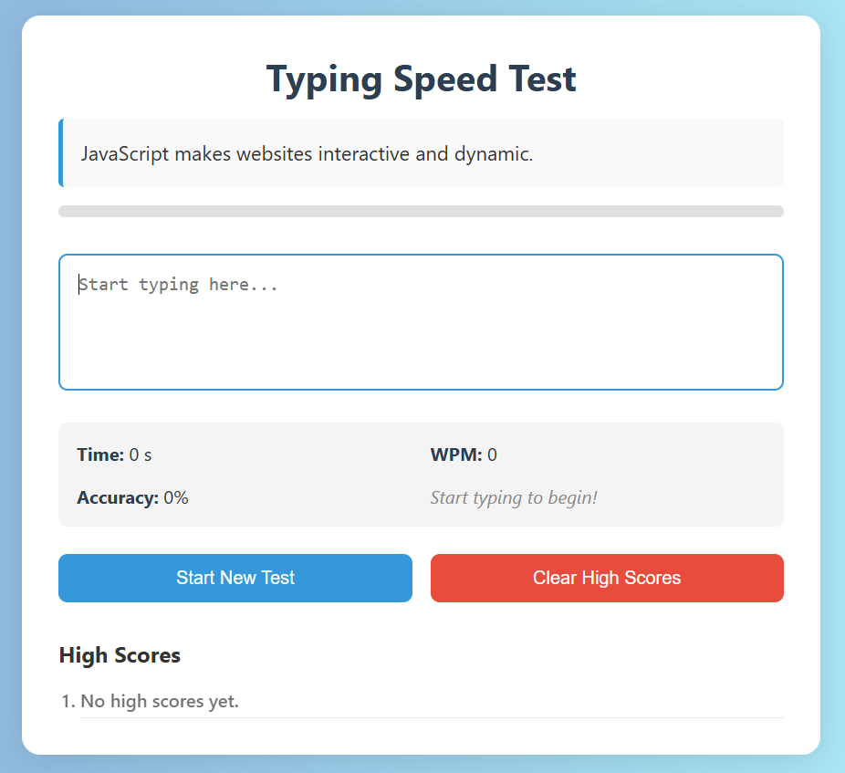

# Typing-Speed-Test
A clean and interactive typing speed test app built using HTML, CSS, and JavaScript. Measures WPM, accuracy, and tracks high scores — perfect for improving your typing skills.
## 🌟 Features

- 📄 Random motivational quotes to type
- ⏱ Real-time timer and live WPM calculation
- ✅ Accuracy tracking as you type
- 🧠 Top 5 high scores stored locally
- 📊 Animated progress bar
- 🔁 Reset and clear scores functionality

## 🚀 How to Use

1. Open the app in your browser.
2. Start typing the displayed quote.
3. Get instant feedback on your typing speed and accuracy.
4. Try again to beat your high score!

## 🛠 Tech Stack

- HTML5
- CSS3
- Vanilla JavaScript

## 📷 Preview




## 📁 Local Setup

```bash
git clone https://github.com/Rishita-Paliwal/Typing-Speed-Test.git
cd Typing-Speed-Test
open index.htm
